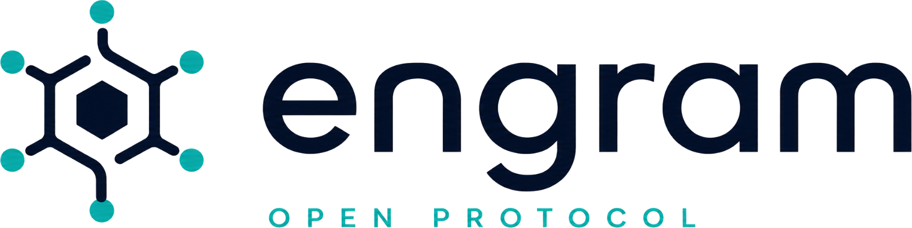

  

# Engram Memory Protocol

**The open standard for portable, governed AI memory.**

Engram is an open protocol that defines how any AI runtime retrieves structured, signed, user-governed memory from any conforming provider.

One HTTP endpoint. Any runtime. User controls everything.

## Start Here

- [Read the RFC](spec/v0.1.md)
- [View the GitHub README](README.md)
- [Use the logo and brand assets](assets/)

